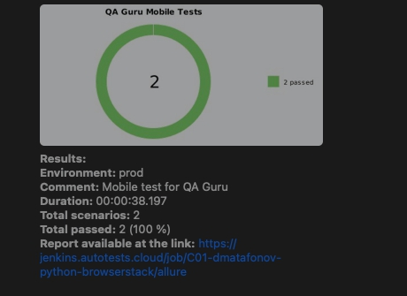
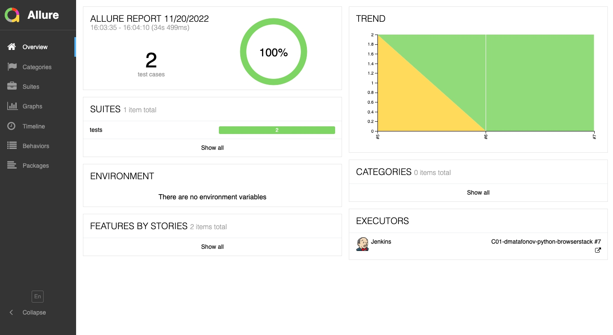

# Автотесты для мобильного приложения 

*  Wikipedia


* Чеклист
  * ✅ Проверка работоспособности кнопки поиска в приложении
  * ✅ Поиск по ключевому слову 'BrowserStack' в приложении
  * ✅ Поиск по ключевому слову 'Software quality assurance' в приложении
  * ✅ Проверка найденного контента

## Запуск
* в .env определить параметры конфигурации:
    - USER, KEY - настройки selenoid
    - API_BROWSERSTACK, APPIUM_BROWSERSTACK - url для browserstack


### Local
```
pytest .
```

### Remote
```bash
python -m venv venv
pip install -r requirements.txt
pytest tests
```

### Уведомление о прохождении тестов в Telegram


### Отчёт о прохождении автотестов в Allure Report


